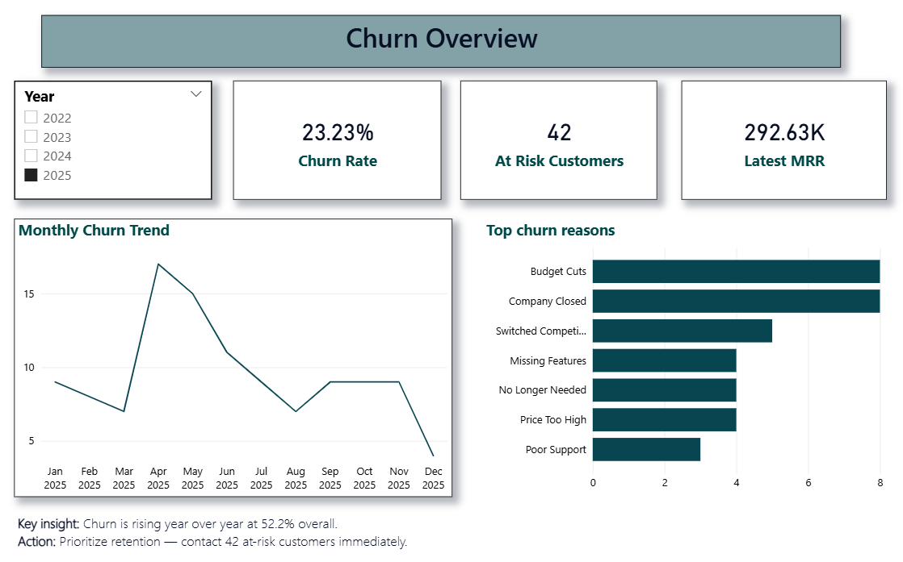
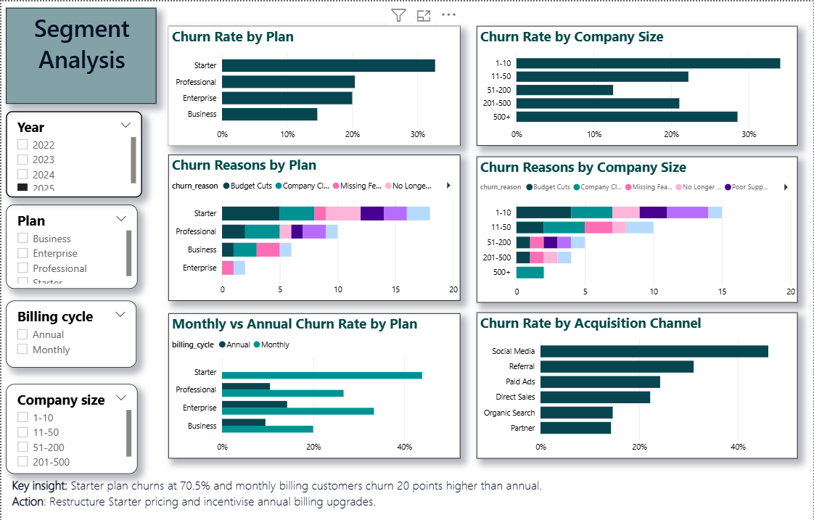
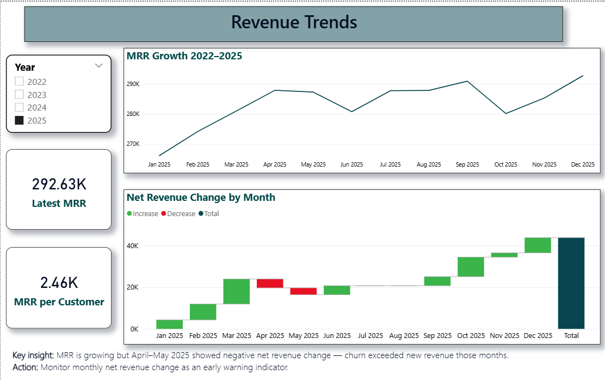
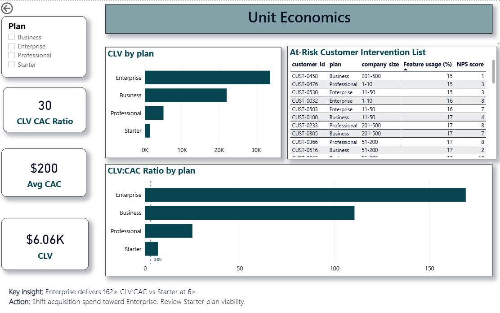

# 📊 CloudTask Pro — Customer Churn & Revenue Analysis

An end-to-end data analysis project examining churn trends, customer segmentation, and unit economics for a fictional SaaS company with 600 customers across 4 years (2022–2025).

**🛠️ Tools:** SQL Server · Power BI · DAX

---

## 🧩 Problem Statement

CloudTask Pro's board raised concerns about a high churn rate despite growing revenue. The CFO needed answers to four key questions:

1. What is the overall churn rate and how has it trended over 4 years?
2. Which subscription plan and billing cycle has the highest churn?
3. What are the top reasons customers churn — and do they differ by plan or company size?
4. What are the unit economics (CLV vs CAC) by plan — which plans are most and least profitable?

---

## 🗂️ Dataset

| File | Description | Rows |
|---|---|---|
| `subscriptions.csv` | Customer-level data — plan, billing cycle, churn status, feature usage, NPS | 600 |
| `monthly_revenue.csv` | Monthly aggregated revenue, new customers, churn counts, CAC | 48 |

---

## 🔍 Key Findings

### Churn
- **Overall churn rate: 52.2%** — 313 of 600 customers have churned
- Churn is rising over time — from ~2 customers/month in early 2022 to ~9/month by late 2024
- **42 active customers are currently at risk** (feature usage below 30%)

### 📋 By Plan
| Plan | Churn Rate | Avg CLV | CLV:CAC Ratio |
|---|---|---|---|
| Enterprise | 22.0% | $32,588 | 162× |
| Business | 41.2% | $21,112 | 105× |
| Professional | 48.0% | $4,674 | 23× |
| Starter | 70.5% | $1,225 | 6× |

### 🔄 Billing Cycle Impact
- Monthly billing: **60.5% churn**
- Annual billing: **40.3% churn**
- A 20 percentage point difference — annual customers retain significantly better

### ⚠️ Top Churn Reasons
1. Budget Cuts (53 customers)
2. Price Too High (51 customers)
3. Company Closed (48 customers)

Price sensitivity is the dominant theme across all plans.

### 💰 Unit Economics
- Average CAC: **$200** across all acquisition channels
- Enterprise CLV:CAC of **162×** — for every $200 spent acquiring an Enterprise customer, the company generates $32,588 in return
- Starter CLV:CAC of **6×** — well below the healthy 3× minimum threshold on a blended basis

---

## ✅ Recommendations

1. **🔴 Investigate Starter plan pricing** — 70.5% churn signals a price/value mismatch. Consider restructuring or sunsetting the plan
2. **📅 Incentivise annual billing** — the 20pp churn gap justifies aggressive discounting on annual plans
3. **📞 Immediate CS outreach to 42 at-risk customers** — feature usage below 30% is a leading indicator of churn
4. **🚀 Double down on Enterprise acquisition** — $32,588 CLV against $200 CAC is exceptional. Shift acquisition spend toward this segment

---

## 📊 Dashboard

Built in Power BI with 4 report pages:

**Page 1 — 🏠 Churn Overview**
KPI cards, monthly churn trend line, top churn reasons

**Page 2 — 🔬 Segment Analysis**
Churn by plan, billing cycle, company size, acquisition channel, and churn reasons breakdown

**Page 3 — 📈 Revenue Trends**
MRR growth line chart, net revenue change waterfall, MRR per customer

**Page 4 — 💡 Unit Economics**
CLV by plan, CLV:CAC ratio with 3× reference line, at-risk customer intervention table

### Screenshots

 
---
---
 
---
---
 
---
---

---

## 🗄️ SQL Analysis

Key queries written in SQL Server, organised into 4 files:

| File | Description |
|---|---|
| `Churn_Analysis.sql` | Overall and segment-level churn rates |
| `Revenue_Analysis.sql` | Monthly MRR, new MRR, churned MRR, net revenue change |
| `Unit_Economics.sql` | CLV by plan, CAC, CLV:CAC ratio |
| `At_Risk_Indicators.sql` | Feature usage thresholds, at-risk customer identification |

---

## 🏗️ Data Model

Built as a star schema in Power BI:
- 📅 `DimDate` — generated date table marked for time intelligence
- 👥 `Subscriptions` — fact table with active relationship on signup_date, inactive on churn_date
- 💵 `MonthlyRevenue` — second fact table connected via DimDate

**Key DAX measures:**
`Churn Rate` · `Churned By Month` (USERELATIONSHIP) · `CLV` · `Avg CAC` · `CLV CAC Ratio` · `At Risk Customers` · `Latest MRR` · `MRR per Customer` · `Net Revenue Change` (SUMX)

---

## ▶️ How to Open

1. Download `CloudTask_Churn_Analysis.pbix`
2. Open in [Power BI Desktop](https://powerbi.microsoft.com/desktop) (free)
3. If prompted about data source, re-point to the CSV files in this repo

---

## 🧠 Skills Demonstrated

| Category | Skills |
|---|---|
| **SQL Server** | CTEs, DATEDIFF, CROSS JOIN, CASE WHEN, aggregations, subqueries |
| **Power BI** | Data modelling, Power Query (M), relationships, time intelligence |
| **DAX** | CALCULATE, SUMX, AVERAGEX, USERELATIONSHIP, DIVIDE, VAR/RETURN |
| **Analytics** | Churn analysis, unit economics, SaaS metrics, CLV:CAC, segmentation |

---

## ⚠️ Limitations

- Dataset is synthetic — real-world data would contain duplicates, nulls, and inconsistencies requiring additional cleaning
- CAC is a blended company average and cannot be broken down by plan with the available data
- Churn reasons are self-reported and may not fully reflect actual drivers
- CLV:CAC ratios are unusually high compared to real SaaS benchmarks due to the synthetic nature of the dataset
